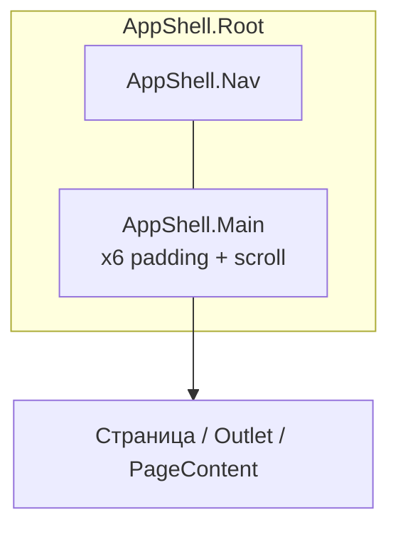

# AppShell

## About

Каркас приложения: **сетка** `nav` + **`main`** (прокручиваемая колонка). Поля контентной колонки (**`--prime-sys-spacing-x6`** по вертикали и горизонтали) **встроены в `AppShell.Main`** — отдельной обёртки нет.

**`AppShell.Template`** — рекомендуемая сборка: **`Root`** + **`Nav`** + **`Main`**, дети шаблона рендерятся **прямо внутри** `<main>`, плюс при монтировании **внутри React Router** сбрасывается прокрутка **`main`** при смене пути.

**Не** дублируйте те же поля вокруг страницы: внутри **`main`** используйте **`PageContent.Section`** или **`PageContent.Root`** (у **`PageContent`** краевых полей к колонке нет — их даёт **`Main`**).

---

## Схема слоёв и отступов

Внешние поля у контента в правой колонке задаёт **сам** элемент **`AppShell.Main`** (класс **`layoutMain`** в сборке; в DOM — **`data-app-shell-main-padded`** для проверки в DevTools).

### Дерево регионов

```
┌─ AppShell.Root ───────────────────────────────────────────── fillViewport → высота вьюпорта, без padding
│    data-layout-template="app" (у Template)
│
├── AppShell.Nav          data-layout-region="nav"            padding: 0 у оболочки; внутренние отступы — у Sidebar
│    └── …
│
└── AppShell.Main         <main> ScrollContainer, прокрутка по вертикали
     data-layout-region="main"
     data-app-shell-main-padded=""
     padding-block / padding-inline = var(--prime-sys-spacing-x6)   ← канон полей колонки
     └── маршруты: <Outlet /> / страницы / PageContent.*
```

### Зазор между колонками

На **`min-width: 48rem`**, если **`data-layout-template="app"`** и сайдбар **`expanded`** или **`compact`**, между **`Nav`** и **`Main`** — **`column-gap: var(--prime-sys-spacing-x3)`** (разделитель колонок, не замена полей внутри `main`).

### Сводка по токенам

| Участок | Токен / правило |
|--------|------------------|
| Поля контента внутри `main` | `--prime-sys-spacing-x6` (block + inline) |
| Зазор nav ↔ main (широкий экран + открытый sidebar) | `--prime-sys-spacing-x3` |
| Корень сетки, слот `nav` | `padding: 0` у оболочек; поля `main` — см. выше |

### Диаграмма (Mermaid)



---

## Composition

- **`AppShell.Root`** — корневая сетка; опционально **`fillViewport`**.
- **`AppShell.Nav`** — слот навигации (**`data-layout-region="nav"`**).
- **`AppShell.Main`** — **`<main>`** с каноническими полями колонки и прокруткой (**`data-layout-region="main"`**).
- **`AppShell.Template`** — **`Root`** + **`Nav`** + **`Main`**, дети — **прямые** дочерние узлы **`main`** + сброс прокрутки при смене **`pathname`** (если предок — React Router).

### Пример (сайдбар + маршруты)

```tsx
import { AppShell, Sidebar } from "prime-ui-kit";
import { Outlet } from "react-router-dom";

export function AppLayout() {
  return (
    <AppShell.Template fillViewport nav={<Sidebar.Root /* … */>{/* … */}</Sidebar.Root>}>
      <Outlet />
    </AppShell.Template>
  );
}
```

### Пример (одна колонка, без `nav`)

```tsx
import { AppShell } from "prime-ui-kit";

export function FullWidthMain() {
  return (
    <AppShell.Root fillViewport>
      <AppShell.Main>{/* страница — поля уже на main */}</AppShell.Main>
    </AppShell.Root>
  );
}
```

---

## Почему «пропали отступы»

1. **Не подключены стили пакета** — **`prime-ui-kit/styles.css`** и **`prime-ui-kit/bundle.css`** (или эквивалент).
2. **Маршруты не внутри `AppShell.Template`** — **`Outlet`** должен быть ребёнком **`Template`** (или контент внутри **`AppShell.Main`** при ручной сборке).
3. **Ожидание полей от `PageContent.Root`** — краевые поля задаёт **`Main`**, не **`PageContent`**.
4. **Редкий full-bleed в `main`** — при необходимости обнулите поля через **`className`** на **`AppShell.Main`** (осознанно, точечно).

---

## Rules

- **`AppShell.Template`** внутри **`BrowserRouter`** / **`MemoryRouter`** — для сброса прокрутки.
- **`ref`** на **`Template`** вешается на **`<main>`** (`AppShell.Main`).
- Не дублируйте обёртки с полями **`x6`** вокруг страницы.

## API

### AppShell.Root

| Prop | Type | Default | Required | Description |
|------|------|---------|----------|-------------|
| fillViewport | `boolean` | `false` | No | Растягивает корень на высоту вьюпорта. |
| className | `string` | — | No | Класс на корневом `div`. |
| children | `React.ReactNode` | — | No | Обычно `Nav` + `Main`. |
| …rest | `HTMLAttributes<HTMLDivElement>` | — | No | В т.ч. `ref` (`forwardRef`). |

### AppShell.Template

| Prop | Type | Default | Required | Description |
|------|------|---------|----------|-------------|
| fillViewport | `boolean` | — | No | Пробрасывается в `Root`. |
| className | `string` | — | No | Класс на `Root`. |
| nav | `React.ReactNode` | — | **Yes** | Левая колонка (напр. `Sidebar.Root`). |
| children | `React.ReactNode` | — | No | Контент внутри `<main>` (прямые дети). |
| navProps | `Omit<AppShellNavProps, "children">` | — | No | Пропсы на слот навигации. |
| mainProps | `Omit<AppShellMainProps, "children">` | — | No | Пропсы на `main` (напр. `id`, `tabIndex`). |
| …rest | `HTMLAttributes<HTMLDivElement>` | — | No | Остальное на `Root`. |

`AppShell.Nav` и `AppShell.Main` — см. исходные типы в **`AppShell.tsx`**.

## Related

- [PageContent](../../components/page-content/COMPONENT.md)
- [Sidebar](../sidebar/COMPONENT.md)
